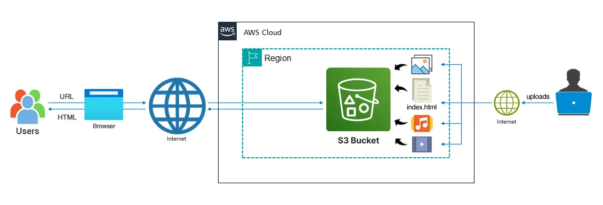
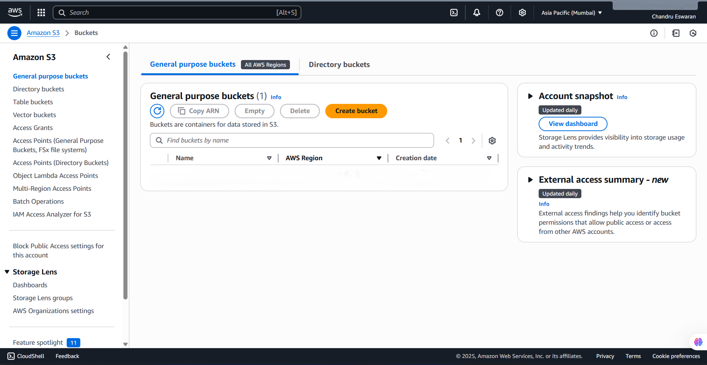
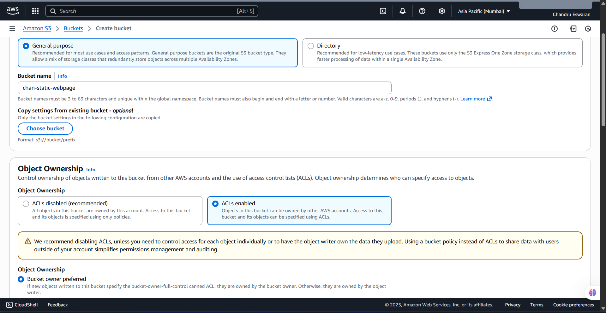
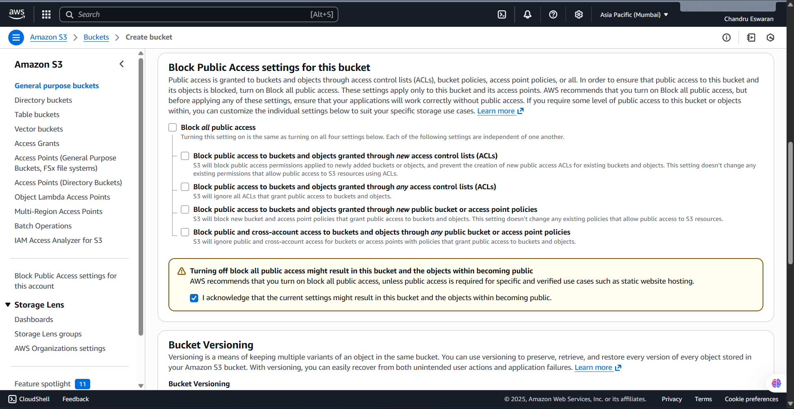
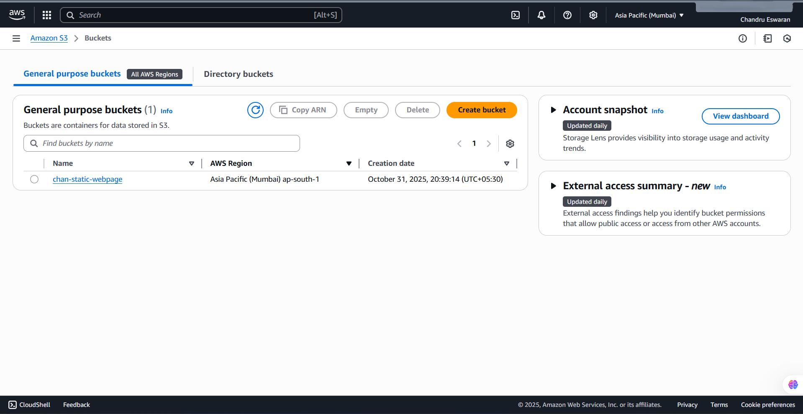
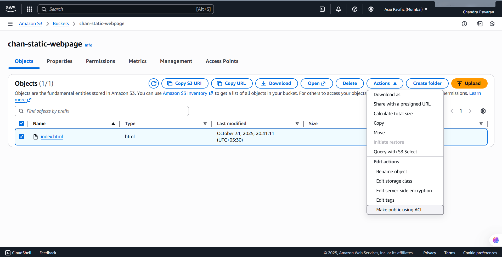
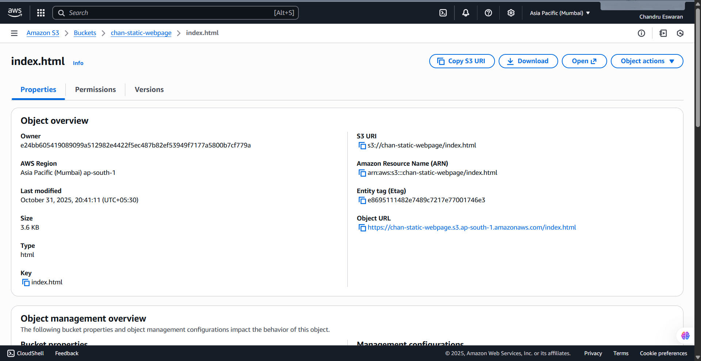

# How to host Static Website on Amazon S3

Amazon Simple Storage Service (Amazon S3) can be used to host static Websites without a need for a Web server (at an extremely low cost). 
S3 buckets can be used to host the HTML, CSS and JavaScript files for entire static websites.

## Introduction

AWS S3 - It is probably the most commonly used, go-to storage service for AWS users given the features like extremely high `availability`, `security`, and `simple connection` to other AWS Services.
- An Amazon S3 bucket can be set up to operate similarly to a website. 
This section illustrates how to host a website using Amazon S3. 
There are some steps to hosting a static website using Amazon Web Service (AWS) S3.

## Advantages of Hosting Website on S3

- **Performance**: The website will be highly performant and scalable at a fraction of the cost of a traditional Web server.

- **Scalability**: Amazon S3 is inherently scalable. For popular websites, the Amazon S3 architecture will scale seamlessly to serve thousands of HTTP requests per second without any changes to the architecture.

- **Availability**: In addition, by hosting with Amazon S3, the website is inherently highly available.

---

## Instructions to Bucket Creating

1. Open the Amazon S3 console by logging into the AWS Management Console at `https://console.aws.amazon.com/s3/`
   
   - Click on Create Bucket

- `Choose Bucket Name` - Bucket Name Should be Unique
- `AWS Region` -  Choose a region close to you or the region where you want to create the bucket (Example - Mumbai)
- `Object Ownership` - Enable for making Public, Otherwise disable

2. Uncheck (Block all public access) for the public, otherwise set default.
   
   - If you uncheck (Block all public keys).

- **Bucket Versioning**:- You have to do Nothing (Disable)
- **Tags(0)** : Optional
- **Default encryption**: Disable

3. Now upload code files
   
   - Select Bucket and `Click your Bucket Name`

Now, click on upload (`then click add File/folder`) and select your HTML code file from your Device.

4. Make public Object
   
   - Now, Click on Objects.
   - Select your All Objects.
   - Now, Click on Actions.
   - Select Make Public Using ACL.
   - Now, Click on Make Public and Close.

5. Copy your Object URL
   
   - Now, click on your HTML File Object Name.
   - Copy the Object URL.

6. Check out your Website
   
   - Directly Paste this URL into the Other Tab or your other System.
   - You Successfully Host Your Website by AWS S3.

---

### My S3 Hosting Webpage

**Access the site in browser strctured in**: `http://{bucket-name}.s3-website-{AWS-Region}.amazonaws.com`
[See Here](https://chan-static-webpage.s3.ap-south-1.amazonaws.com/index.html)
